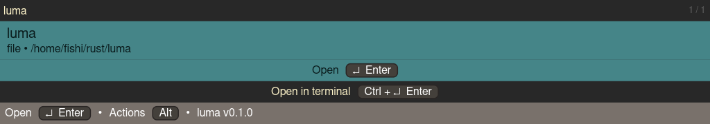

# Luma - luma unifies minor actions

A tool for "yes" [running .desktop files, searching and indexing the file system, conversions, etc.]

> [!NOTE]
> **DISCLAIMER:** This should be considered very early beta for now.

> [!CAUTION]
> When running lua plugins, they will have **full and unrestricted access** to your system, within the confinement of a non-root userspace application.
> This means that they **can harm your system**. Only run lua plugins from trusted sources or verify them working correctly beforehand!

## Features

- Luma is currently a linux-only application with goals of extending it to windows (and potentially macos if a maintainer were to be found.)
- Luma employs multi-threading, asynchronous code, caching strategies and file indexing to provide fast and snappy searches
- Luma supports the creation of plugins in the lua scripting language to enhance it's capabilities
- Luma has a very minimal and fast ui, powered by [iced](https://iced.rs/)

## Supported Platforms

Luma is tested on the following platforms:

- Arch Linux

## Dependencies

- `xdg-mime`
- `notify-send`

Iced Dependencies:
- `expat`
- `libgl`
- `fontconfig`
- `freetype` (or `freetype2`?)
- `pkg-config`
- `libx11`
- `libxcursor`
- `libxi`
- `libxrandr`
- `wayland`
- `libxkbcommon`

Development Dependencies:
- rust toolchain 1.85.0

# Screenshots

- Application Launcher (Theme: Oxocarbon)

- File Search (Theme: Gruvbox Dark)

- Theme selector (Theme: Dracula)

- Action Popup (Theme: Ferra)

- Conversion Plugin (Theme: Nord)

- Dice roll plugin (Theme: Catpuccin Frappé)

# Speed

These are some rough estimates i made while running the application:

Measured in Debug mode:

- Filtering and displaying around 30 lines in a lua plugin: 800µs - 1ms
- Indexing /home (14000 files and directories found after filtering): 6s
- Searching through all indexed file (~14000): 54ms

Measured in Release mode:

- Indexing /home (~24000 files and directories after filtering): 1.119s
- Indexing / (~320310 files and directories): 7.797s
- Queries with ~24000 files, 65 .desktop files, around 25ms
- Queries with ~320334 files, 65 .desktop files, around 190ms

# Known Bugs

> On wayland, the window centers around it's collapsed size (size with no entries). This is due to winit/iced not supporting setting the window position on wayland.
> See [`iced#1440`](https://github.com/iced-rs/iced/pull/1440), [`iced#1287`](https://github.com/iced-rs/iced/issues/1287)
>
> Possible Fix: Set the window size to the maximum window size initially and then set the window size to the correct one, which should hopefully not cause any issues.
