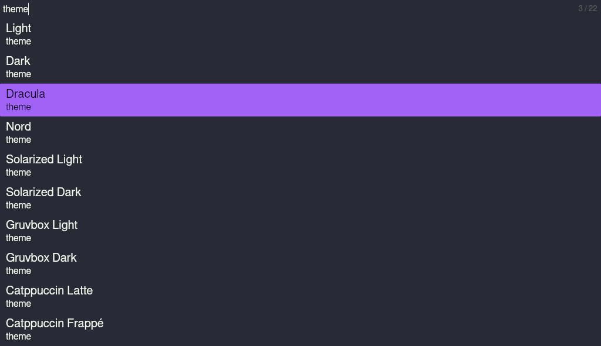
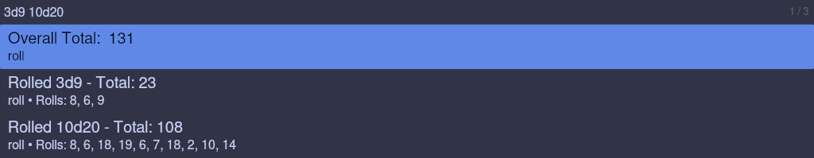

# Luma - luma unifies minor actions

A tool for "yes" [running .desktop files, searching and indexing the file system, conversions, etc.]

> [!NOTE]
> **DISCLAIMER:** This should be considered very early alpha for now.

> [!CAUTION]
> Due to default hardcoded config in [`src/main.rs`](./src/main.rs), upon first running the application, **it will index your entire home directory ($HOME) and watch it**, with exceptions to hidden files (files starting with a `.`, files named `node_modules` and files named `target`).
>
> To stop this from happening, either remove this from the default config by commenting out the `FileWatcherEntry` value in the `CONFIG` global in  [`src/main.rs`](./src/main.rs)
> or disable the files plugin by removing the line `state.add_plugin::<FilePlugin>();`.

> [!CAUTION]
> When running lua plugins, they will have **full and unrestricted access** to your system, within the confinement of a non-root userspace application.
> This means that they **can harm your system**. Only run lua plugins from trusted sources or verify them working correctly beforehand!

## Features

- Luma is currently a linux-only application with goals of extending it to windows (and potentially macos if a maintainer were to be found.)
- Luma employs multi-threading, asynchronous code, caching strategies and file indexing to provide fast and snappy searches
- Luma supports the creation of plugins in the lua scripting language to enhance it's capabilities
- Luma has a very minimal and fast ui, powered by [iced](https://iced.rs/)

## Supported Platforms

Luma is tested on the following platforms:

- Arch Linux

## Dependencies

- `xdg-mime`
- `notify-send`

Iced Dependencies:
- `expat`
- `libgl`
- `fontconfig`
- `freetype` (or `freetype2`?)
- `pkg-config`
- `libx11`
- `libxcursor`
- `libxi`
- `libxrandr`
- `wayland`
- `libxkbcommon`

Development Dependencies:
- rust toolchain 1.85.0

# Screenshots

- Theme selector (Theme: Dracula)

- Action Popup (Theme: Ferra)

- Conversion Plugin (Theme: Nord)

- Dice roll plugin (Theme: Catpuccin Frappé)

# Speed

These are some rough estimates i made while running the application:

Filtering and displaying around 30 lines in a lua plugin: 800µs - 1ms
Indexing /home (14000 files and directories found after filtering): 6s
Searching through all indexed file (~14000): 54ms
